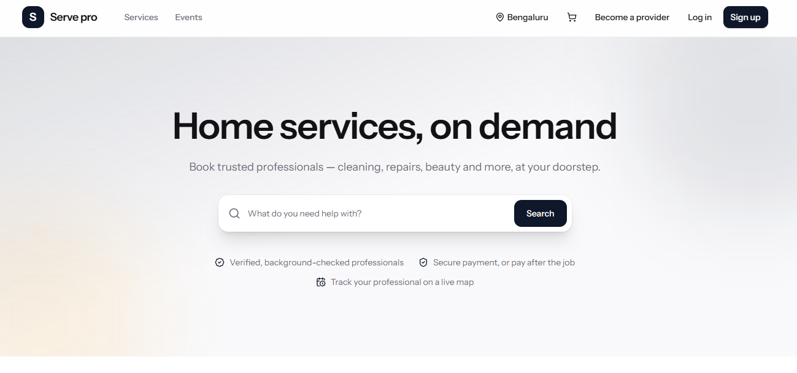
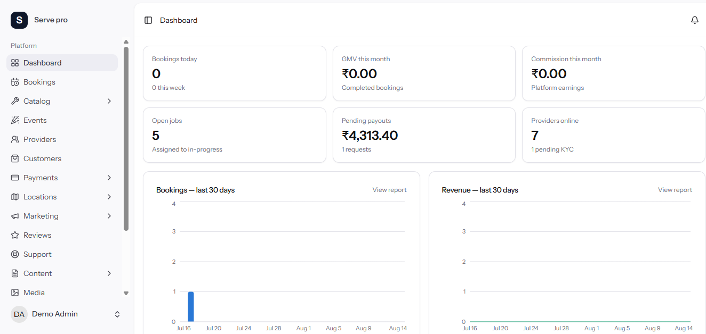
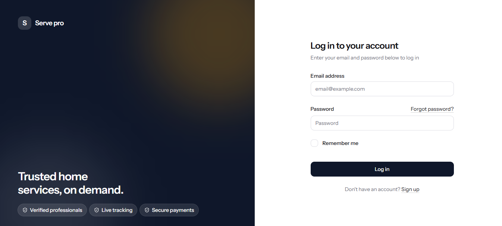

<div align="center">

# ServePro — On‑Demand Home Services Platform

**An Urban Company–style marketplace, built end to end.**
Customers book. Professionals get dispatched. You watch the money, the map and the marketplace from one panel.

[](https://laravel.com)
[](https://php.net)
[](https://react.dev)
[](https://typescriptlang.org)
[](https://inertiajs.com)
[](https://tailwindcss.com)
[](#engineering-quality)
[](#engineering-quality)
[](LICENSE)

</div>

---

<div align="center">

<em>The storefront — city-aware catalogue, search, and a booking flow that ends in a live map.</em>
</div>

---

## What this is

A complete, production-grade services marketplace: **one Laravel application** serving three roles — customer, service professional and administrator — with real-time job dispatch, live GPS tracking, five payment gateways, GST invoicing, commission and payouts, a CMS and page builder, and a browser-based installer.

It is not a demo or a tutorial project. Every feature listed below is finished, tested and reconciled against the database: 25 delivered modules, 38 tables, 863 automated tests, and a security and performance hardening pass on top.

| | |
|---|---|
| **Live tracking without Node.js** | Laravel Reverb WebSockets + HTML5 Geolocation + Leaflet/OpenStreetMap — a single PHP deployable, no second runtime to host |
| **Money that reconciles** | Snapshotted totals, append-only ledgers, row-locked idempotent settlement — a webhook replayed ten times still books one payment |
| **Nothing hardcoded** | Branding, currency, tax, copy, theme colours and every string live in settings and translation files |
| **Installs from a browser** | Requirements check → database → migrate → admin account → done. No config file edited by hand |
| **Fails quietly, never loudly** | A dead SMS provider, an unreachable Reverb, an unconfigured mail server — the booking still completes |

---

## Screens

<table>
<tr>
<td width="50%">

<p align="center"><em><b>Admin dashboard</b> — GMV, commission, open jobs, pending payouts and providers online, with 30-day booking and revenue charts. Every figure is reconcile-tested against raw SQL.</em></p>
</td>
<td width="50%">

<p align="center"><em><b>Login</b> — the side panel (headline, copy, artwork) is owned by the administrator, not the code. Blank it and the form centres itself.</em></p>
</td>
</tr>
</table>

---

## Feature tour

<details open>
<summary><b>For customers</b></summary>

- **Catalogue** — categories → sub-categories → services, with fixed, hourly or *inspection-first* pricing, paid add-ons and cross-sell strips
- **Events surface** — weddings, birthdays and parties get their own storefront page, sharing one catalogue engine
- **Cart & checkout** — survives sign-in, city- and zone-aware, contact phone captured and snapshotted
- **Slot picker** — drawn in *the city's own timezone*, bounded by lead time and booking horizon
- **Live tracking** — watch the professional approach on a map, with a smooth animated marker, trail and ETA; polling takes over automatically if the socket drops
- **Job-start code** — a code the customer reads out before work begins, proving the right person is at the right door
- **Payments** — Razorpay, PayU, Stripe, PayPal, wallet, bank transfer with receipt upload, or cash after the job
- **Wallet, coupons, referrals** — refunds land in the wallet; coupons carry min-order, usage and first-order rules; referrers are paid on the referee's first completed job
- **GST invoice** — a compliant PDF generated from figures fixed at booking time
- **Reviews** — one per completed job, with photos; favourites, rebooking and a help desk

</details>

<details>
<summary><b>For service professionals</b></summary>

- **Onboarding & KYC** — profile, categories, working hours, base location and service radius; documents uploaded to a private disk and reviewed by an admin, with a clean resubmission loop
- **Job offers** — nearest-first or broadcast dispatch, time-limited, with an open offer's payload deliberately kept doorstep-free (city only, until accepted)
- **Journey screen** — throttled GPS streaming with a wake lock, "customer is watching" presence, and one-tap Google Maps navigation
- **Earnings ledger** — per-job gross, commission and net, including the case where a cash job leaves the professional owing commission
- **Payouts** — request against the released balance; the destination account is snapshotted so editing it later cannot rewrite a settled payout
- **Availability** — online toggle, blackout dates, and support access even before approval

</details>

<details>
<summary><b>For administrators</b></summary>

- **Dashboard & reports** — KPI tiles, charts, top services, provider leaderboard, city performance; CSV exports that stream inline or queue for large sets
- **Operations** — bookings board, manual dispatch and status transitions, refunds, provider review queue, customer records with block/unblock and "log in as"
- **Money** — payments hub with offline verification, bank accounts, commission (global or per category), payout approvals, wallet adjustments
- **Marketplace** — cities and map-drawn zones, catalogue CRUD, coupons, banners, popups, testimonials, sponsors, subscribers
- **Content** — block-based page builder (14 block types), CMS pages, blog with scheduling and RSS, menus, FAQs, media library
- **Platform** — 25 settings groups, email and SMS providers with test send, notification matrix, announcements, SEO and sitemap, reCAPTCHA, analytics, S3-compatible storage, language manager, activity log, system health and one-button updates

</details>

---

## Tech stack

| Layer | Choice | Why |
|---|---|---|
| Backend | **Laravel 12**, PHP 8.3 (8.2 minimum) | Actions pattern, thin controllers, domain layer under `app/Domain` |
| Frontend | **Inertia.js v2 + React 19 + TypeScript** (strict) | One router, one auth, zero API glue — server-driven pages with a real SPA feel |
| UI | **shadcn/ui + Tailwind CSS v4** | Token-driven theming; the buyer's brand colour reaches every surface, down to the loading splash |
| Realtime | **Laravel Reverb** (WebSockets) | Live tracking and notifications with **no Node.js process to host** |
| Maps | **Leaflet + OpenStreetMap**, Nominatim proxy | No map vendor key required to run |
| Database | MySQL 8 / MariaDB (SQLite for tests) | 38 tables, all geometry maths in PHP so every engine agrees |
| Payments | Razorpay · PayU · Stripe · PayPal | Raw HTTP clients, no vendor SDKs — one `PaymentGateway` contract, one settlement path |
| Files | spatie/medialibrary, local or S3-compatible | Private disks for KYC, receipts and documents; public for marketing |
| PDF / CSV | dompdf · league/csv | GST invoices and report exports |
| Testing | **Pest** (feature, unit, arch, security, performance) | 863 tests, ~5 000 assertions |
| Analysis | **PHPStan / Larastan level 6**, ESLint, Prettier, `tsc --noEmit` | Green on every commit |

---

## Architecture

```
app/
├─ Domain/           # the business: one folder per capability, actions inside
│  ├─ Booking/       #   BookingStateMachine — the only way a status changes
│  ├─ Dispatch/      #   eligibility finder + nearest / broadcast strategies
│  ├─ Tracking/      #   session lifecycle, ping validation, broadcasting
│  ├─ Payments/      #   gateway contract, wallet service, idempotent confirm
│  ├─ Earnings/      #   commission resolver, append-only ledger, payouts
│  ├─ Blocks/        #   page-builder block registry
│  └─ …              #   Coupons, Reviews, Cms, Comms, Seo, Cities, Installer
├─ Http/             # thin controllers, form requests, resources, presenters
├─ Models/           # Eloquent only — no business logic
└─ Support/          # Money, upload rules, private-file serving

resources/js/        # React 19 + TypeScript pages, layouts and shadcn components
docs/                # architecture, schema, conventions, roadmap + handover pack
tests/               # Feature · Unit · Arch · Security · Performance
```

**Principles the code actually enforces:**

- A booking status only ever changes through `BookingStateMachine` — 14 states, guarded transitions, full history
- Money columns are **snapshots**; ledgers are **append-only**. A refund appends a reversal, it never edits the original row
- An unpaid online booking is **never dispatched** — cash starts `placed`, gateway starts `pending_payment` and only advances when money settles
- Rating averages are **recomputed, never incremented**, so hiding an unfair review genuinely corrects it
- Third-party services **degrade to off** — the platform runs with no Firebase, no SMTP, no SMS, no reCAPTCHA, no S3
- A lazy database load is a **test failure**, not a slow page

---

## Engineering quality

| | |
|---|---|
| **863 tests** across feature, unit, architecture, security and performance suites | ~5 000 assertions, parallel-safe |
| **Architecture tests** | The domain layer may not import HTTP; models stay Eloquent-only; every action exposes a known entry point; no `dd()`, no double-registered listeners |
| **Route sweeps** | Every admin route must carry auth and role; every private-file route must be authenticated; every unauthenticated write must be throttled — asserted by sweeping the route table, not by sampling |
| **Secret-exposure test** | Credential keys are derived from the settings registry, a sentinel is written into each, all 25 settings screens are rendered, and the sentinel must appear in none |
| **Query budget** | Query counts must not grow when row counts grow — this caught an N+1 that lazy-load protection structurally cannot see |
| **Security pass** | One upload allowlist, `Content-Disposition` on private downloads, global security headers, rate limiters, replay-proof webhooks for all four gateways |

---

## Running it locally

> **Read the [LICENSE](LICENSE) first** — this repository is published for study and evaluation, not for production or commercial use.

```bash
git clone https://github.com/Mady93823/multi-service-pro.git
cd multi-service-pro

composer install
npm install

cp .env.example .env          # ships with INSTALL=false — this opens the wizard
php artisan key:generate
npm run build

php artisan serve
```

Open `http://localhost:8000` and the **setup wizard** takes over: requirements check → database credentials → migrate and seed → administrator account → finish. Tick *demo data* to get a browsable catalogue, zones and bookings.

For live tracking and notifications during development, run the extra processes:

```bash
php artisan reverb:start      # WebSockets
php artisan queue:work        # notifications and exports
php artisan schedule:work     # payouts, expiries, pruning
```

**Quality gates:**

```bash
php artisan test --parallel        # 863 tests
./vendor/bin/phpstan analyse       # level 6
npm run lint && npx tsc --noEmit   # ESLint + TypeScript
```

---

## Documentation

The repository ships with its full documentation set.

| Document | Contents |
|---|---|
| `docs/internal/` | Architecture, module specs, tech-stack decisions (ADRs), database schema, live-tracking spec, roadmap, conventions |
| `docs/handover/00-Welcome.md` | Platform guide — every capability in plain language |
| `docs/handover/01-Install-Guide.md` | The browser installer, step by step |
| `docs/handover/productionvpssetup.md` | Blank VPS → live HTTPS site: DNS, Nginx (with the WebSocket proxy), certificates, background services |
| `docs/handover/02–05` | Administrator manual, professional guide, customer guide, and the build story |

---

## Roadmap

Designed and reserved for after launch, when real trade can shape them:

- **Staff accounts with granular permissions** — additional admin logins scoped to what they need
- **Module manager** — feature areas toggled from the panel

---

## License

**Educational Use License** — you may download, run, study and modify this code for personal learning, teaching or evaluation. Production use, commercial use, hosting it as a service and redistribution are **not** permitted. See [LICENSE](LICENSE) for the exact terms.

Commercial licensing is available — open an issue or get in touch.

---

<div align="center">

Built with care, tested to the point of boredom, and documented like someone else has to run it.

</div>
