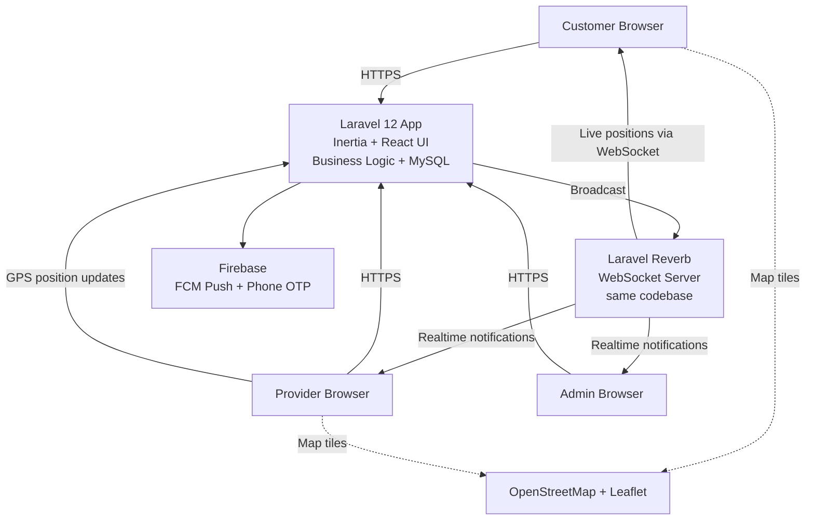
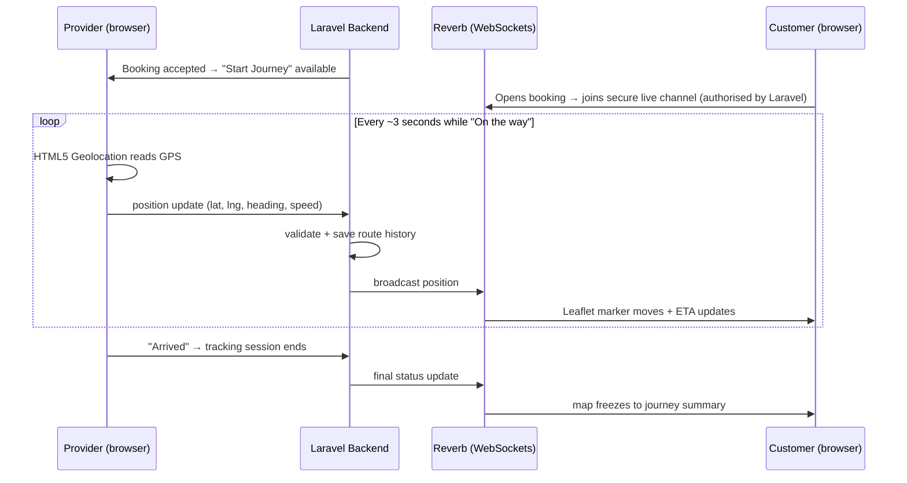

# UrbanServe — Requirement Analysis & Technical Proposal

> **Prepared for:** Client review and sign-off
> **Document purpose:** Define the modules, roles, and technology stack for an on-demand home services web application inspired by Urban Company, before development begins.
> **Working title:** *UrbanServe* (final brand name to be confirmed by client)

---

## 1. Executive Summary

UrbanServe is a web platform where customers book home services (cleaning, salon, appliance repair, plumbing, electrical work, etc.), verified service providers fulfil those bookings, and an administrator controls the entire marketplace.

The platform is built as a **3-role system**:

| Role | Who they are | What they do |
|---|---|---|
| **Customer** | End user | Browses services, books time slots, pays online, tracks the provider live on a map, rates the service |
| **Service Provider** | Verified professional / partner | Manages profile & availability, accepts jobs, shares live location while travelling, earns and withdraws money |
| **Admin** | Platform owner | Manages services, approves providers, monitors bookings, sets commission, handles payouts, views reports |

Key differentiator requested by the client: **live location tracking** — the customer watches the assigned provider approach in real time on a map, similar to food-delivery apps.

---

## 2. Scope Overview

### 2.1 In Scope (this phase)

- Responsive **web application** (works on mobile browsers, tablets, and desktop)
- All three role panels: Customer site, Provider panel, Admin panel
- Live location tracking with real-time updates
- Online payments (Razorpay: UPI, cards, netbanking, wallets) + commission handling
- GST-compliant invoicing
- Installable **PWA** (app-like icon and push notifications, no app store needed)
- SEO-ready public pages (sitemap, structured data) for organic traffic
- Push notifications (Firebase)
- Customer & provider **help center** (support tickets with admin reply queue)
- One-click style **web installer** for easy deployment
- Modular codebase designed for **easy future expansion**

### 2.2 Out of Scope (available as future phases)

- Native Android / iOS apps (the architecture is API-ready for them)
- Multi-vendor company accounts (teams of providers under one company)
- Multi-language / RTL interface (structure will support it; translation work is phase 2 — Hindi first)
- In-app chat between customer and provider
- WhatsApp notifications (planned as an optional add-on later)

---

## 3. Modules

The system is split into 16 clean modules. Each module is independent and expandable. The feature set has been cross-checked against Urban Company so nothing customers expect is missing.

### M01 — Authentication & Accounts
- Email / phone registration and login for all three roles
- OTP verification (Firebase Phone Authentication)
- Password reset, profile management, avatar upload
- Role-based access control (Customer / Provider / Admin)

### M02 — Service Catalog
- Categories → Sub-categories → Services (e.g., *Home Cleaning → Kitchen → Deep Kitchen Cleaning*)
- Pricing models: fixed price, hourly, or "inspection first" quote
- Service add-ons and extras
- Search, filters, featured services, service images and descriptions
- "People also book" related-service suggestions (admin-curated cross-sell)

### M03 — Locations, Zones & Addresses
- Admin defines operating cities and service zones on a map
- Services can be enabled/disabled per zone
- Customer address book with map-pin selection (Leaflet + OpenStreetMap)
- Automatic address lookup (geocoding)

### M04 — Booking Engine
- Add-to-cart style service selection
- Date & time-slot scheduling with provider availability check
- Full booking lifecycle: `placed → assigned → accepted → on the way → arrived → in progress → completed`
- Reschedule, cancellation with configurable free-cancel window and cancellation fee
- Booking history, invoices, and one-tap **"Book again"** with favourite providers
- **Job-start OTP**: provider enters a code shown on the customer's screen to start the job — proof the right professional is at the right door (same trust mechanism Urban Company uses)
- Booking photos: customer attaches photos of the problem; provider uploads before/after proof

### M05 — Provider Onboarding & Management
- Provider registration with KYC document upload (ID, certificates)
- Admin approval workflow (pending → verified → active / suspended)
- Skills & service-category mapping, working hours, service radius
- Availability calendar, vacation/blackout dates, and instant online/offline toggle

### M06 — Dispatch & Job Assignment
- Automatic assignment to the nearest available, qualified provider
- Or broadcast mode: job offered to all eligible providers, first to accept wins
- Accept / decline with response timeout and automatic re-assignment
- Manual override: admin can assign any job to any provider

### M07 — Live Location Tracking ⭐
> [!important] Updated per client decision (v1.2)
> **WebSockets (Laravel Reverb) + HTML5 Geolocation + OpenStreetMap + Leaflet** — the realtime engine now runs inside Laravel itself, so **no Node.js is required on the server**. Same live experience, simpler hosting.

- When the provider taps **"Start Journey"**, their browser shares GPS position via HTML5 Geolocation
- Positions stream to the customer over WebSockets (Laravel Reverb — Laravel's official realtime server)
- Customer sees a live map (Leaflet + OpenStreetMap — no Google Maps fees) with a moving provider marker, route trail, distance and ETA
- Status timeline: *On the way → Arrived → Job started → Completed*
- Full details in Section 5.

### M08 — Payments & Wallet
- **Razorpay** payment gateway (client-confirmed): UPI first, plus cards, netbanking, wallets, EMI
- "Pay after service" (cash / UPI on completion) — enabled at launch; admin can disable
- Customer wallet: top-up, refunds to wallet, pay from wallet
- Automatic **GST-compliant invoices** (GSTIN, CGST/SGST/IGST breakup, configurable tax rates)

### M09 — Commission & Provider Payouts
- Admin-configurable commission (global % or per-category)
- Provider earnings ledger: every job shows gross, commission, net
- Payout requests with admin approval and settlement history

### M10 — Reviews & Ratings
- Post-completion star rating + written review + photo uploads
- Provider average rating shown on booking screens
- Customers can favourite providers and rebook them directly
- Admin moderation (hide/remove abusive reviews)

### M11 — Notifications
- Push notifications via **Firebase Cloud Messaging** (booking updates, job offers, payout status)
- Email notifications for key events (booking confirmation, invoices)
- In-app notification center for all roles
- Real-time updates over WebSockets (no page refresh needed)

### M12 — Coupons & Promotions
- Promo codes: flat / percentage, usage limits, expiry, first-order-only
- Referral program: both referrer and new customer receive wallet credit
- Homepage banners and promotional sections managed by admin

### M13 — Admin Dashboard & Reports
- KPI dashboard: today's bookings, revenue, active providers, top services
- Reports: bookings, revenue, commission earned, provider performance
- CSV / Excel export
- Support tools: "login as user" for troubleshooting (fully audited) + admin activity log

### M14 — CMS & Platform Settings
- Editable pages (About, Terms, Privacy, FAQ)
- Global settings: business name, logo, currency, tax rate, booking rules
- Feature toggles (enable/disable cash payment, wallet, coupons…)

### M15 — Web Installer & Updates
- Guided browser-based installer: server requirements check → database setup → admin account creation → done
- No command-line knowledge required to install
- Versioned update mechanism for future releases

### M16 — Help Center & Support Tickets
- Customers and providers raise support tickets (optionally linked to a booking) with attachments
- Admin ticket queue: categories, priorities, assignment, threaded replies, canned responses
- Reply notifications (push + in-app + email); full history retained

---

## 4. Technology Stack

| Layer | Technology | Why |
|---|---|---|
| Backend framework | **Laravel 12 (PHP 8.3+)** | Client requirement. Mature, secure, huge ecosystem, easy to hire for |
| Database | **MySQL 8** | Reliable, available on virtually every host |
| Frontend | **React 19 + Inertia.js + TypeScript** | Modern, fast, app-like UI without a separate API layer; official Laravel starter stack |
| UI components | **shadcn/ui + Tailwind CSS v4** | Modern, clean, cool design system; thousands of ready blocks discoverable via shoogle.dev |
| Realtime engine | **Laravel Reverb (WebSockets)** | Laravel's official realtime server — live tracking and instant updates with **no extra runtime to install or maintain** (client-preferred: everything stays Laravel) |
| Maps | **Leaflet + OpenStreetMap** | Client-specified. Zero map licensing cost (no Google Maps billing) |
| Device location | **HTML5 Geolocation API** | Client-specified. Works in every modern browser, no app install needed |
| Push notifications | **Google Firebase (FCM)** | Client-approved. Free tier covers push at scale |
| OTP login | **Firebase Phone Auth** | Same Firebase project; optional toggle |
| Payments | **Razorpay** | Client-confirmed. UPI + cards + netbanking + wallets — built for the Indian market |
| Auth / API tokens | **Laravel Sanctum** | Secure sessions now; ready-made API for future mobile apps |
| Build tooling | **Vite** | Instant dev builds, optimized production bundles |
| Cache & queues | Database driver by default, **Redis optional** | Keeps installation simple; Redis unlocks higher scale when needed |

> [!note] UI component research
> Ready-made, high-quality UI blocks (booking forms, dashboards, map panels) are sourced from shadcn registries via **shoogle.dev** — confirmed available: map components (Watermelon UI, Eldora UI), booking forms (Stow), booking dashboards (Shadcn UI Kit, lndev/UI). This accelerates development while keeping a consistent modern look.

### 4.1 High-Level Architecture

One application, one language, one database — the WebSocket server is part of the same Laravel installation, which keeps hosting and maintenance simple.

---

## 5. Live Location Tracking — How It Works

**Customer experience:** opens the booking → sees a live map with the provider's moving marker, travelled route, distance remaining and ETA — updating every few seconds without refreshing.

**Reliability:** if a WebSocket connection is blocked (rare corporate networks), the map automatically falls back to periodic polling, so tracking never appears "dead".

**Privacy:** location is shared only between "Start Journey" and "Arrived", only for the assigned booking, and only with that booking's customer and the admin.

---

## 6. Non-Functional Requirements

| Area | Commitment |
|---|---|
| **Design** | Modern, fast, app-like UI (shadcn/ui); fully responsive; light & dark mode |
| **Performance** | Page loads under ~2s on 4G; lazy-loaded images; optimized production build |
| **Security** | Role-based permissions, encrypted passwords, CSRF/XSS protection, rate limiting, authorised private tracking channels, KYC files stored privately |
| **Easy installation** | Browser-based installer wizard; single PHP/Laravel stack — no second runtime |
| **Expandability** | Modular domain structure, event-driven hooks, API-first design — new modules (e.g., chat, mobile apps) plug in without rewriting existing code |
| **Data ownership** | Everything (except Firebase push/OTP) runs on the client's own server and database |

> [!warning] Hosting requirement
> Live tracking needs the WebSocket process (part of Laravel) running continuously, so the platform needs a **VPS or cloud server** (e.g., DigitalOcean, Hetzner, AWS Lightsail — from ~$6/month) rather than basic shared hosting. Only PHP is required on the server — no Node.js. The installer and a server setup guide make deployment straightforward.

---

## 7. Delivery Plan (Phases)

| Phase | Deliverable | Modules |
|---|---|---|
| **0. Sign-off** | This document approved, wireframes confirmed | — |
| **1. Foundation** | Installer base, auth for all 3 roles, admin panel skeleton, service catalog | M01, M02, M14, M15 |
| **2. Booking core** | Zones & addresses, booking engine, provider onboarding, dispatch | M03, M04, M05, M06 |
| **3. Live tracking** | Realtime engine (Reverb), live map, notifications | M07, M11 |
| **4. Money** | Razorpay payments, GST invoices, wallet, commission, payouts | M08, M09 |
| **5. Growth tools** | Reviews, coupons, reports, help center, CMS polish | M10, M12, M13, M16 |
| **6. Hardening & handover** | Testing, security pass, installer finalization, documentation, deployment | All |

Each phase ends with a working demo the client can click through and approve.

---

## 8. India Launch Strategy

> [!tip] Recommendation
> **Build multi-city capable. Launch in ONE city.**

The platform is engineered for unlimited cities and zones from day one — adding a city later is a five-minute admin task, not a development project. But the *business* should launch focused:

1. **One launch city, 2–3 zones, 4–5 core categories** (e.g., cleaning, salon-at-home, AC repair, plumbing, electrician). A services marketplace only works when bookings get accepted quickly — concentrating providers in one city guarantees that. Urban Company itself launched in Delhi-NCR only.
2. **Expand city-by-city** once provider supply and ratings are healthy — done from the admin panel, zero code changes.

### Built-in defaults for the Indian market

| Area | Default |
|---|---|
| Login | Phone-number-first with OTP; email optional |
| Payments | UPI shown first at checkout (Razorpay); cards, netbanking, wallets behind it |
| Pay after service | Enabled — cash or UPI on completion builds trust with first-time users |
| Invoices | GST-compliant: GSTIN, CGST/SGST/IGST breakup |
| Currency | ₹ INR with Indian digit grouping (1,00,000) |
| Languages | English at launch; Hindi-ready structure (translation is a phase-2 task) |
| Devices | Optimized for budget Android phones; installable as a PWA (app icon + push, no app store) |
| Future | WhatsApp notifications as an optional add-on |

---

## 9. Assumptions

1. Single-country (India), INR-only launch (multi-currency possible later)
2. One provider per booking (team bookings are a future phase)
3. Client provides branding (logo, colors) before Phase 1 ends
4. Firebase project is created under the client's Google account (client owns the data)
5. Payment gateway account (Razorpay/Stripe) is registered in the client's name

---

## 10. Client Decisions & Open Questions

### Decided ✅

1. **Payment gateway:** Razorpay, INR
2. **Launch region:** multi-city capable build, single-city launch — full strategy in Section 8
3. **Cash payments:** "pay after service" enabled at launch (recommended in Section 8 — tell us if you disagree)
4. **Realtime engine:** Laravel Reverb (WebSockets inside Laravel) — no Node.js on the server, per client's hosting preference (2026-07-06)

### Still open ❓

> [!question] Please confirm before Phase 4
> 1. **Commission model** — flat percentage for all services, or different per category?
> 2. **Provider payouts** — weekly, monthly, or on-request withdrawals?
> 3. **OTP login** — SMS OTP required at launch? (Firebase free tier has monthly SMS limits; email login is free)
> 4. **Brand name & domain** — final name to replace the working title "UrbanServe"?
> 5. **Hosting** — is a VPS already available, or should one be recommended and set up?
> 6. **Launch city** — which city goes first?

---

*End of document — Version 1.2. Development begins with Phase 1; only Phase 4 (payments configuration details) waits on the remaining questions.*
