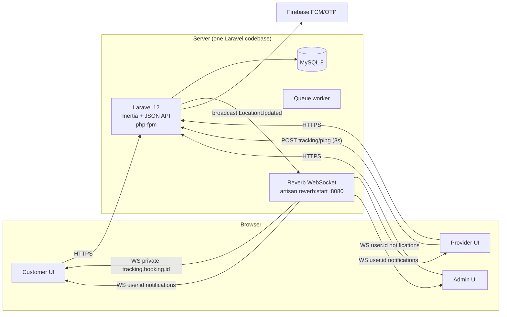

# 01 — Architecture

## Shape: modular monolith — ONE deployable (D11)

One Laravel app carries everything: business logic, all three role panels, MySQL, payments, dispatch, notifications, installer, **and realtime via Laravel Reverb** (first-party WebSocket server, Pusher protocol). Reverb runs as a second *process* of the same codebase (`php artisan reverb:start`), not a second service. A queue worker is the third process. All three managed by supervisor/systemd templates the installer prints.

> [!tip] Why
> Client's hosting cannot run Node.js (decision 2026-07-06, [[03-Tech-Stack]] D11). Reverb keeps the mandated WebSocket experience with zero extra runtime. Do NOT extract microservices.

## Repository layout

```
urban/                        ← repo root
├── CLAUDE.md                 ← build rules pointer
├── docs/                     ← this documentation
│   ├── client/
│   └── internal/
├── app/ ... (Laravel 12 app at root, standard layout)
├── resources/js/             ← React + Inertia frontend
│   ├── pages/                ← Inertia pages (customer/, provider/, admin/)
│   ├── components/           ← shared + shadcn/ui components
│   ├── layouts/              ← CustomerLayout, ProviderLayout, AdminLayout
│   └── lib/                  ← utils, echo client, leaflet helpers
```

Laravel lives at repo root (not nested) — simplest for the web installer and shared tooling. No `tracking-server/` — realtime is Reverb inside the same app (D11).

## Request/data flow



## Boundaries & contracts

| Boundary | Contract |
|---|---|
| Frontend → Laravel | Inertia for pages; `/api/v1/*` (Sanctum) for anything a future mobile app needs — write API endpoints alongside web routes from day one for booking, tracking ping, notifications |
| Provider GPS → Laravel | `POST /api/v1/bookings/{id}/tracking/ping` `{lat, lng, accuracy, heading, speed}` — throttled client-side to 1/3s; Laravel validates via policy, writes `tracking_sessions.last_*` + `tracking_points`, broadcasts |
| Laravel → browsers | Reverb channels: `private-tracking.booking.{id}` (`LocationUpdated`, `ShouldBroadcastNow`), `presence-tracking.booking.{id}` (who's watching), `private-user.{id}` (in-app notifications). Authorization in `routes/channels.php` — booking's customer/provider/admin only |

## Role panels = route groups, one app

- `/(customer routes)` — public site + customer account. Prefix: none.
- `/provider/*` — provider panel. Middleware: `role:provider`, `provider.approved`.
- `/admin/*` — admin panel. Middleware: `role:admin`.

Three Inertia layouts, three navigation shells, one codebase. Spatie `laravel-permission` guards everything.

## Expandability mechanisms (the "easy expandable" promise)

1. **Domain events** — every significant state change fires an event (`BookingPlaced`, `BookingAccepted`, `ProviderApproved`, `PaymentCaptured`, `JobCompleted`…). New features subscribe via listeners; existing code never gets edited for add-ons.
2. **Settings registry** — `settings` table + typed accessor; feature flags (`cash_enabled`, `wallet_enabled`, `otp_required`) so behavior changes without code changes.
3. **API-first** — Sanctum-protected `/api/v1` mirrors web capabilities → mobile apps later without backend rework.
4. **Notification channels abstraction** — Laravel notifications with FCM + mail + database channels; adding SMS later = one new channel class.

## Scaling path (document, don't prematurely build)

| Load | Action |
|---|---|
| Launch | Single VPS: nginx + php-fpm, MySQL, `reverb:start` + queue worker under supervisor, all on one box |
| Growth | Move MySQL to managed DB; add Redis (cache, queues, Reverb pub/sub) |
| Big | Multiple Reverb instances behind LB with Redis pub/sub; Laravel horizontal scale; Horizon queue workers |

Related: [[03-Tech-Stack]], [[05-Live-Tracking]], [[07-Conventions]]
