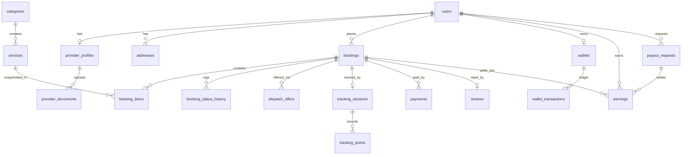

# 04 — Database Schema

MySQL 8. Conventions: `id` BIGINT UNSIGNED PK, `created_at/updated_at` everywhere, soft deletes only where noted `(SD)`, money as `DECIMAL(12,2)`, coordinates as `DECIMAL(10,7)` (or `POINT SRID 4326` where spatial queries needed), all statuses are string enums backed by PHP enum classes.

## Identity & access

```
users (SD)
  id, name, email (uniq, nullable), phone (uniq, nullable), password,
  avatar_path, email_verified_at, phone_verified_at, is_active, last_login_at

(spatie tables) roles, permissions, model_has_roles, ...

provider_profiles
  id, user_id (uniq FK), bio, experience_years, base_lat, base_lng,
  service_radius_km, working_hours JSON, is_online, approval_status
  [pending|approved|rejected|suspended], approval_note,
  rating_avg DECIMAL(3,2), rating_count, jobs_completed

provider_documents
  id, provider_profile_id FK, type [id_proof|address_proof|certificate|photo],
  file_path (private disk), status [pending|approved|rejected], reject_reason,
  reviewed_by FK users, reviewed_at

provider_categories
  provider_profile_id FK, category_id FK  (pivot: what they can do)

fcm_tokens               ← M11; collected even while Firebase is unconfigured (D14)
  id, user_id FK, token (uniq), device_type [web|android|ios], last_used_at
```

## Catalog & geography

```
categories (SD)
  id, parent_id (self FK, null = root), name, slug (uniq), icon_path,
  image_path, sort_order, is_active

services (SD)
  id, category_id FK, name, slug (uniq), short_description, description,
  pricing_type [fixed|hourly|inspection], price, duration_minutes,
  is_featured, is_active, sort_order

service_addons
  id, service_id FK, name, price, is_active

zones
  id, name, city, geojson JSON (GeoJSON Polygon — source of truth; membership
  via PHP point-in-polygon, D12: no GEOMETRY column, portable across
  MySQL/MariaDB/sqlite), is_active

service_zone
  service_id FK, zone_id FK  (pivot: availability per zone)

service_related
  service_id FK, related_service_id FK  (pivot: admin-curated cross-sell)

addresses
  id, user_id FK, label [home|work|other], line1, line2, city, postal_code,
  lat, lng, zone_id FK nullable (resolved on save), is_default
```

## Bookings & dispatch

```
bookings (SD)
  id, code (uniq human ref, prefix from settings booking.code_prefix e.g.
  BK-2026-000123), customer_id FK users, provider_id FK users nullable,
  address_id FK nullable (nulled if the customer deletes the address),
  address_snapshot JSON (label/lines/city/postal/lat/lng — survives address
  deletion; snapshot rule), zone_id FK nullable,
  scheduled_at, slot_end_at, status (see [[02-Modules]] M04 enum),
  subtotal, addon_total, discount, coupon_id FK nullable, tax,
  tax_breakup JSON (CGST/SGST/IGST snapshot), total,
  payment_status [unpaid|paid|refunded|partial_refund],
  payment_method [gateway|cash|wallet], commission_rate_snapshot,
  commission_amount, provider_earning, job_otp_code CHAR(4) nullable,
  cancellation_fee DECIMAL nullable (snapshot at cancel time),
  notes, completed_at, cancelled_at,
  cancel_reason, cancelled_by FK users nullable

booking_items
  id, booking_id FK, service_id FK, name_snapshot, price_snapshot, qty,
  addons_snapshot JSON

booking_status_history
  id, booking_id FK, from_status, to_status, actor_id FK users nullable,
  actor_type [customer|provider|admin|system], note, created_at

dispatch_offers
  id, booking_id FK, provider_id FK, strategy [nearest|broadcast|manual],
  status [offered|accepted|declined|expired], round, distance_km,
  offered_at, responded_at, expires_at
  -- M06: unique(booking_id, provider_id); round groups a re-dispatch cycle so
  --      a timeout expires just that batch; distance_km snapshots Haversine km
```

## Tracking

```
tracking_sessions
  id, booking_id FK, provider_id FK, status [active|ended],
  started_at, ended_at,
  last_lat, last_lng, last_accuracy_m, last_heading, last_speed_kmh,
  last_ping_at
  -- M07: index(booking_id, status). "One active session per booking" is
  --      enforced in StartTrackingSession (idempotent), not by a DB
  --      constraint — ended sessions legitimately repeat per booking.
  --      last_* is the checkpoint the polling fallback serves.

tracking_points          ← provider pings via Laravel (1/3s while en_route), pruned after 30 days
  id, tracking_session_id FK, lat, lng, accuracy_m, speed_kmh, heading,
  recorded_at (indexed)
  -- M07: index(tracking_session_id, recorded_at); `tracking:prune` (daily)
  --      deletes past tracking.points_retention_days
```

> [!note] MariaDB strict mode rejects a non-nullable `timestamp` with no default — `started_at` and `recorded_at` use `->useCurrent()` (the dev box is XAMPP/MariaDB).

## Money

```
payments
  id, booking_id FK, gateway [razorpay|stripe|cash|wallet], gateway_ref,
  amount, currency, status [initiated|captured|failed|refunded],
  payload JSON, captured_at

wallets
  id, user_id (uniq FK), balance  ← cached; ledger is source of truth

wallet_transactions      ← append-only, never update/delete
  id, wallet_id FK, type [topup|payment|refund|payout|adjustment],
  direction [credit|debit], amount, balance_after, reference_type,
  reference_id, note, created_at

earnings                 ← provider ledger, append-only
  id, provider_id FK, booking_id FK, payout_request_id FK nullable,
  type [job|reversal|adjustment], gross, commission, collected_amount, net,
  commission_rate, status [pending|available|paid_out], available_at, note

payout_requests
  id, provider_id FK, amount, status [requested|approved|paid|rejected],
  method_details JSON, processed_by FK users, processed_at, reference, note
```

> [!note] **Shipped M08 (2026-07-09).** `payments`: `booking_id` FK **restrict** (money-bearing), `gateway(20)`, nullable `gateway_ref`, `amount decimal(12,2)`, `currency char(3)` default `INR`, `status(20)` default `initiated`, `payload` JSON, `captured_at`, `index(booking_id, status)`, and **`unique(gateway, gateway_ref)`** — the webhook-idempotency backstop (`gateway_ref` stays null until a session is opened; MySQL/MariaDB allow repeated NULLs in a unique index, so parallel attempts are fine).
>
> `wallets`: `user_id` unique, cascade on user delete. `wallet_transactions`: `wallet_id` FK **restrict**, `created_at` via `->useCurrent()` and **no `updated_at`** (`public const UPDATED_AT = null;` on the model) — MariaDB strict mode rejects a non-nullable `timestamp` with no default.
>
> `WalletService` is the only writer of both wallet tables: it locks the wallet row, appends the ledger entry with `balance_after`, and updates the cached `wallets.balance` inside one transaction, so `balance == sum(credits) − sum(debits)` holds after every movement (pinned by a reconcile assertion in `tests/Feature/Payments/WalletTest.php`).

> [!note] **Shipped M09 (2026-07-10).** `categories.commission_percent decimal(5,2)` nullable — null inherits the parent category, then the `payments.commission_percent` setting.
>
> `earnings`: `provider_id`/`booking_id` FK **restrict** (money-bearing), `payout_request_id` FK nullable, `index(provider_id, status)`, and **`unique(booking_id, type)`** — the double-write backstop that stops a re-fired completion listener paying twice, exactly as `payments.unique(gateway, gateway_ref)` stops a replayed webhook.
>
> Every row satisfies **`net = gross − commission − collected_amount`** (asserted in `tests/Feature/Earnings/EarningsLedgerTest.php`). `gross` is the pre-tax service value; `collected_amount` is the customer's full total on a **cash** job (zero otherwise), so a cash job's `net` is **negative** — the provider owes commission plus the GST they took at the door. **Never clamp the sign.**
>
> Append-only like `wallet_transactions`: a refund appends a `type = reversal` row negating the job row column for column; corrections are `adjustment` rows. `status` is a lifecycle flag, not a money column — `earnings:release` flips `pending → available` once `available_at` passes, and a paid payout flips its claimed rows to `paid_out`.
>
> `payout_requests`: `provider_id` FK restrict, `processed_by` FK nullOnDelete. A request claims the provider's **whole** released balance; the claimed `earnings` rows carry its id, so rejection is a clean unclaim (`payout_request_id = null`). Only one open (`requested|approved`) request per provider, enforced under a row lock in `RequestPayout`.

## Engagement & platform

```
reviews                  ← M10; photos via medialibrary collection review_photos (private disk)
  id, booking_id (uniq FK), customer_id FK, provider_id FK, rating TINYINT,
  comment, is_hidden, hidden_reason

coupons
  id, code (uniq), type [flat|percent], value, max_discount, min_order,
  usage_limit, per_user_limit, first_order_only, starts_at, ends_at, is_active

coupon_usages
  id, coupon_id FK, user_id FK, booking_id FK, discount_applied

referrals
  id, referrer_id FK users, referee_id FK users (uniq), code_used,
  reward_amount, status [pending|rewarded], rewarded_at

provider_blackouts
  id, provider_profile_id FK, starts_on DATE, ends_on DATE, reason

favorite_providers
  id, customer_id FK users, provider_id FK users, uniq(customer_id, provider_id)

support_tickets
  id, user_id FK, booking_id FK nullable, subject,
  category [booking|payment|provider|account|other],
  priority [low|normal|high], status [open|pending|resolved|closed],
  assigned_to FK users nullable, resolved_at

support_ticket_messages
  id, support_ticket_id FK, sender_id FK users, message,
  (attachments via medialibrary), created_at

languages
  id, code (uniq e.g. en, hi), name, is_active, is_default

notifications            ← Laravel standard database channel table (M11)
  uuid id, type, notifiable_type, notifiable_id, data TEXT, read_at

banners
  id, title, image_path, link_url, placement [home_hero|home_strip],
  sort_order, starts_at, ends_at, is_active

pages
  id, slug (uniq), title, body (markdown), is_published

faqs
  id, question, answer, sort_order, is_active

settings
  id, group, key (uniq), value TEXT, type [string|int|bool|json|decimal]
```

> [!note] **Shipped M10 (2026-07-10).** `reviews`: `booking_id` unique FK **cascade** (pure child content), `customer_id`/`provider_id` FK restrict, `index(provider_id, is_hidden)` — the rating recompute and every public listing filter on visibility. `rating_avg`/`rating_count`/`jobs_completed` on `provider_profiles` are **recomputed, never incremented**, by listeners (`SyncProviderRatingOnReviewChange` over visible reviews, `SyncProviderJobStatsOnCompletion` over completed bookings) — hiding a review recomputes too, so a hidden 1-star stops dragging the average (ADR D17). Photos live on a `review_photos` medialibrary collection (private disk) served through the guest-reachable, policy-checked `reviews.photos.show` route; a hidden review's photos 404.

## Integrity rules

- Booking money columns are **snapshots** — never recompute historical bookings from current prices/rates
- `wallet_transactions` and `earnings` are append-only; corrections = compensating entries (`adjustment`)
- Every status change goes through the state machine + writes `booking_status_history`
- Foreign keys ON DELETE: RESTRICT for money-bearing rows; CASCADE only for pure child rows (items, points)
- Indexes: every FK; `bookings(status, scheduled_at)`, `bookings(provider_id, status)`, `services FULLTEXT(name, short_description)`, `zones(city, is_active)` (membership computed in PHP, D12), `tracking_points(tracking_session_id, recorded_at)`

## ERD (core)



Related: [[02-Modules]] · [[05-Live-Tracking]]
