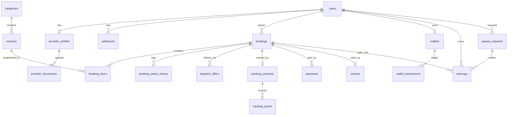

# 04 — Database Schema

MySQL 8. Conventions: `id` BIGINT UNSIGNED PK, `created_at/updated_at` everywhere, soft deletes only where noted `(SD)`, money as `DECIMAL(12,2)`, coordinates as `DECIMAL(10,7)` (or `POINT SRID 4326` where spatial queries needed), all statuses are string enums backed by PHP enum classes.

## Identity & access

```
users (SD)
  id, name, email (uniq, nullable), phone (uniq, nullable), password,
  referral_code (uniq, nullable — lazy-generated, M12),
  avatar_path, email_verified_at, phone_verified_at, is_active, last_login_at

(spatie tables) roles, permissions, model_has_roles, ...

provider_profiles
  id, user_id (uniq FK), bio, experience_years, base_lat, base_lng,
  service_radius_km, working_hours JSON, is_online, approval_status
  [pending|approved|rejected|suspended], approval_note,
  rating_avg DECIMAL(3,2), rating_count, jobs_completed

provider_documents
  id, provider_profile_id FK, type [id_proof|address_proof|certificate|photo],
  file_path (private disk), status [pending|approved|rejected], reject_reason,
  reviewed_by FK users, reviewed_at

provider_categories
  provider_profile_id FK, category_id FK  (pivot: what they can do)

fcm_tokens               ← M11; collected even while Firebase is unconfigured (D14)
  id, user_id FK, token (uniq), device_type [web|android|ios], last_used_at
```

## Catalog & geography

```
categories (SD)
  id, parent_id (self FK, null = root), name, slug (uniq), icon_path,
  image_path, sort_order, is_active

services (SD)
  id, category_id FK, name, slug (uniq), short_description, description,
  pricing_type [fixed|hourly|inspection], price, duration_minutes,
  is_featured, is_active, sort_order

service_addons
  id, service_id FK, name, price, is_active

cities (M25)
  id, name, slug (uniq), state nullable, timezone, center_lat, center_lng,
  is_active, sort_order
  ↳ the timezone is load-bearing: the booking slot grid is drawn in the city's
    own clock (D36). center_* only opens the map.

zones
  id, city_id FK (restrict — M25; the old free-text `city` string was
  backfilled into rows and dropped), name, geojson JSON (GeoJSON Polygon —
  source of truth; membership via PHP point-in-polygon, D12: no GEOMETRY
  column, portable across MySQL/MariaDB/sqlite), is_active
  ↳ a zone only serves while its city is active (Zone::scopeActive), which is
    how one click closes a whole town without touching its bookings.

service_zone
  service_id FK, zone_id FK  (pivot: availability per zone)

service_related
  service_id FK, related_service_id FK  (pivot: admin-curated cross-sell)

addresses
  id, user_id FK, label [home|work|other], line1, line2, city, postal_code,
  lat, lng, zone_id FK nullable (resolved on save), is_default
```

## Bookings & dispatch

```
bookings (SD)
  id, code (uniq human ref, prefix from settings booking.code_prefix e.g.
  BK-2026-000123), customer_id FK users, provider_id FK users nullable,
  address_id FK nullable (nulled if the customer deletes the address),
  address_snapshot JSON (label/lines/city/postal/lat/lng — survives address
  deletion; snapshot rule), zone_id FK nullable,
  scheduled_at, slot_end_at, status (see [[02-Modules]] M04 enum),
  subtotal, addon_total, discount, coupon_id FK nullable, tax,
  tax_breakup JSON (CGST/SGST/IGST snapshot), total,
  payment_status [unpaid|paid|refunded|partial_refund],
  payment_method [gateway|cash|wallet], commission_rate_snapshot,
  commission_amount, provider_earning, job_otp_code CHAR(4) nullable,
  cancellation_fee DECIMAL nullable (snapshot at cancel time),
  notes, completed_at, cancelled_at,
  cancel_reason, cancelled_by FK users nullable

booking_items
  id, booking_id FK, service_id FK, name_snapshot, price_snapshot, qty,
  addons_snapshot JSON

booking_status_history
  id, booking_id FK, from_status, to_status, actor_id FK users nullable,
  actor_type [customer|provider|admin|system], note, created_at

dispatch_offers
  id, booking_id FK, provider_id FK, strategy [nearest|broadcast|manual],
  status [offered|accepted|declined|expired], round, distance_km,
  offered_at, responded_at, expires_at
  -- M06: unique(booking_id, provider_id); round groups a re-dispatch cycle so
  --      a timeout expires just that batch; distance_km snapshots Haversine km
```

## Tracking

```
tracking_sessions
  id, booking_id FK, provider_id FK, status [active|ended],
  started_at, ended_at,
  last_lat, last_lng, last_accuracy_m, last_heading, last_speed_kmh,
  last_ping_at
  -- M07: index(booking_id, status). "One active session per booking" is
  --      enforced in StartTrackingSession (idempotent), not by a DB
  --      constraint — ended sessions legitimately repeat per booking.
  --      last_* is the checkpoint the polling fallback serves.

tracking_points          ← provider pings via Laravel (1/3s while en_route), pruned after 30 days
  id, tracking_session_id FK, lat, lng, accuracy_m, speed_kmh, heading,
  recorded_at (indexed)
  -- M07: index(tracking_session_id, recorded_at); `tracking:prune` (daily)
  --      deletes past tracking.points_retention_days
```

> [!note] MariaDB strict mode rejects a non-nullable `timestamp` with no default — `started_at` and `recorded_at` use `->useCurrent()` (the dev box is XAMPP/MariaDB).

## Money

```
payments
  id, booking_id FK, gateway [razorpay|stripe|cash|wallet|offline], gateway_ref,
  amount, currency, status [initiated|captured|failed|refunded],
  payload JSON, captured_at,
  bank_account_id FK nullable, reference, failure_reason,   ← M22 (offline)
  reviewed_by FK users nullable, reviewed_at
  ↳ proof file: medialibrary collection `proof`, private disk, singleFile

bank_accounts            ← M22; the accounts offered at checkout for a transfer
  id, label, account_name, account_number, ifsc, upi_id, notes,
  is_active, sort_order
  ↳ QR image: medialibrary collection `qr`, public disk

wallets
  id, user_id (uniq FK), balance  ← cached; ledger is source of truth

wallet_transactions      ← append-only, never update/delete
  id, wallet_id FK, type [topup|payment|refund|payout|adjustment],
  direction [credit|debit], amount, balance_after, reference_type,
  reference_id, note, created_at

earnings                 ← provider ledger, append-only
  id, provider_id FK, booking_id FK, payout_request_id FK nullable,
  type [job|reversal|adjustment], gross, commission, collected_amount, net,
  commission_rate, status [pending|available|paid_out], available_at, note

payout_requests
  id, provider_id FK, amount, status [requested|approved|paid|rejected],
  method_details JSON, processed_by FK users, processed_at, reference, note,
  payout_account_id FK nullable                             ← M22

payout_accounts          ← M22; the provider's saved destinations
  id, provider_id FK cascade, type [upi|bank], label,
  account_name, account_number, ifsc, upi_id,
  is_default, is_verified, verified_at
```

> [!note] **Shipped M08 (2026-07-09).** `payments`: `booking_id` FK **restrict** (money-bearing), `gateway(20)`, nullable `gateway_ref`, `amount decimal(12,2)`, `currency char(3)` default `INR`, `status(20)` default `initiated`, `payload` JSON, `captured_at`, `index(booking_id, status)`, and **`unique(gateway, gateway_ref)`** — the webhook-idempotency backstop (`gateway_ref` stays null until a session is opened; MySQL/MariaDB allow repeated NULLs in a unique index, so parallel attempts are fine).
>
> `wallets`: `user_id` unique, cascade on user delete. `wallet_transactions`: `wallet_id` FK **restrict**, `created_at` via `->useCurrent()` and **no `updated_at`** (`public const UPDATED_AT = null;` on the model) — MariaDB strict mode rejects a non-nullable `timestamp` with no default.
>
> `WalletService` is the only writer of both wallet tables: it locks the wallet row, appends the ledger entry with `balance_after`, and updates the cached `wallets.balance` inside one transaction, so `balance == sum(credits) − sum(debits)` holds after every movement (pinned by a reconcile assertion in `tests/Feature/Payments/WalletTest.php`).

> [!note] **Shipped M09 (2026-07-10).** `categories.commission_percent decimal(5,2)` nullable — null inherits the parent category, then the `payments.commission_percent` setting.
>
> `earnings`: `provider_id`/`booking_id` FK **restrict** (money-bearing), `payout_request_id` FK nullable, `index(provider_id, status)`, and **`unique(booking_id, type)`** — the double-write backstop that stops a re-fired completion listener paying twice, exactly as `payments.unique(gateway, gateway_ref)` stops a replayed webhook.
>
> Every row satisfies **`net = gross − commission − collected_amount`** (asserted in `tests/Feature/Earnings/EarningsLedgerTest.php`). `gross` is the pre-tax service value; `collected_amount` is the customer's full total on a **cash** job (zero otherwise), so a cash job's `net` is **negative** — the provider owes commission plus the GST they took at the door. **Never clamp the sign.**
>
> Append-only like `wallet_transactions`: a refund appends a `type = reversal` row negating the job row column for column; corrections are `adjustment` rows. `status` is a lifecycle flag, not a money column — `earnings:release` flips `pending → available` once `available_at` passes, and a paid payout flips its claimed rows to `paid_out`.
>
> `payout_requests`: `provider_id` FK restrict, `processed_by` FK nullOnDelete. A request claims the provider's **whole** released balance; the claimed `earnings` rows carry its id, so rejection is a clean unclaim (`payout_request_id = null`). Only one open (`requested|approved`) request per provider, enforced under a row lock in `RequestPayout`.

> [!note] **Shipped M22 (2026-07-14).** `payments` gains `bank_account_id` (FK **nullOnDelete** — an archived bank account must never take settled payments with it), `reference` (the customer's UTR/txn id), `reviewed_by` (FK users nullOnDelete) + `reviewed_at`, and `failure_reason`. **No new `status` value:** an offline payment waits in the existing `initiated` state and is identified by `gateway = 'offline'` (`Payment::scopeAwaitingVerification()` = exactly that pair). A new state would have obliged every money query written since M08 — the payments hub totals, `bookings:expire-unpaid`, the refund path — to learn about it, and one of them would have been missed. Verification runs through the same row-locked idempotent `ConfirmPayment` a gateway webhook calls (ADR D27).
>
> `bank_accounts`: admin-managed, `is_active` + `sort_order` drive what checkout offers; deleting one that has payments is refused (deactivate instead), and the FK is the backstop.
>
> `payout_accounts`: `provider_id` FK **cascade** (a destination is not money — it dies with its owner), one default per provider enforced in `SavePayoutAccount`, `is_verified` cleared on every edit. `payout_requests.payout_account_id` is a **back-reference for the screens only** — `method_details` remains the snapshot taken at request time (ADR D33), so editing an account cannot rewrite what a settled payout says it paid to. An account with an open request on it cannot be deleted.

## Engagement & platform

```
reviews                  ← M10; photos via medialibrary collection review_photos (private disk)
  id, booking_id (uniq FK), customer_id FK, provider_id FK, rating TINYINT,
  comment, is_hidden, hidden_reason

coupons                  ← M12; code stored uppercase, uniq
  id, code (uniq), type [flat|percent], value, max_discount, min_order,
  usage_limit, per_user_limit, first_order_only, starts_at, ends_at, is_active

coupon_usages            ← M12; append-only audit trail (created_at only, no updates)
  id, coupon_id FK restrict, user_id FK, booking_id FK (uniq), discount_applied

referrals                ← M12; referee_id uniq = a user is referred once, ever
  id, referrer_id FK users, referee_id FK users (uniq), code_used,
  reward_amount (null until rewarded — snapshot of what was paid),
  status [pending|rewarded], rewarded_at

provider_blackouts
  id, provider_profile_id FK, starts_on DATE, ends_on DATE, reason

favorite_providers
  id, customer_id FK users, provider_id FK users, uniq(customer_id, provider_id)

support_tickets          ← M16 shipped (ADR D21); status is a plain guarded
  id, code (uniq TKT-000001), user_id FK cascade,        enum, NOT BookingStateMachine
  booking_id FK nullable nullOnDelete, subject,
  category [booking|payment|account|other],
  priority [low|normal|high], status [open|pending|resolved|closed],
  assigned_to FK users nullable nullOnDelete, resolution_note,
  last_reply_at, resolved_at, closed_at,
  idx(status, priority), idx(user_id, status), idx(assigned_to)

support_ticket_messages  ← M16; is_staff snapshots the author's side at write
  id, ticket_id FK cascade, user_id FK cascade, body,       time (roles can change)
  is_staff BOOL, (attachments via medialibrary collection
  `attachments`, PRIVATE disk, policy-checked serve route),
  idx(ticket_id, created_at)

languages                ← M14; code is the lang/{code}.json FILENAME — strictly
  id, code (uniq e.g.       pattern-validated (path-traversal guard), immutable after
  en, hi), name,            creation; no is_default column — `en` is the hardcoded
  native_name, is_active    protected default (Language::DEFAULT_CODE)

notifications            ← Laravel standard database channel table (M11)
  uuid id, type, notifiable_type, notifiable_id, data TEXT, read_at

email_templates          ← M23; OPTIONAL layer — a missing / disabled / broken row
  id, event_key (uniq),          falls back to the shipped default (D25);
  subject, body (markdown),      body is markdown source, never HTML
  is_enabled

notification_preferences ← M23; event × channel switches
  id, user_id FK nullable cascade (NULL = the platform default an admin sets),
  event_key, channel [mail|sms|fcm]   ← database + broadcast are NOT switchable
  is_enabled, uniq(user_id, event_key, channel)

sms_logs                 ← M23; delivery audit (append-only, created_at only)
  id, user_id FK nullable nullOnDelete, phone, event_key, body,
  gateway, status [sent|failed], response JSON, idx(status, created_at)

banners                  ← M12; image via medialibrary collection image (PUBLIC disk
  id, title, link_url,      — marketing content, not user uploads); link_url scheme-
  placement [home_hero|home_strip],  restricted http/https (stored-XSS guard)
  sort_order, starts_at, ends_at, is_active

pages                    ← M14; body is MARKDOWN SOURCE, HTML never stored —
  id, slug (uniq), title,   MarkdownRenderer (strip html_input, no unsafe links) is
  body (markdown),          the single output path; /p/{slug} public route
  is_published, show_in_footer, sort_order
  idx(is_published, show_in_footer, sort_order)

faqs                     ← M14; plain text, rendered escaped
  id, question, answer, is_active, sort_order
  idx(is_active, sort_order)

settings
  id, group, key (uniq), value TEXT, type [string|int|bool|json|decimal]

activity_logs            ← M13; append-only admin audit (created_at only, no updates,
  id, actor_id FK→users     ActivityLogger is the sole writer); actor nullOnDelete so
  (nullOnDelete), action,   deleting an admin never deletes their trail; subject =
  subject_type+subject_id   nullable morph; context JSON (settings saves store KEYS
  (nullableMorphs),         only — values may contain gateway secrets)
  context JSON, created_at
  idx(actor_id, created_at), idx(action, created_at)
```

> [!note] **Shipped M10 (2026-07-10).** `reviews`: `booking_id` unique FK **cascade** (pure child content), `customer_id`/`provider_id` FK restrict, `index(provider_id, is_hidden)` — the rating recompute and every public listing filter on visibility. `rating_avg`/`rating_count`/`jobs_completed` on `provider_profiles` are **recomputed, never incremented**, by listeners (`SyncProviderRatingOnReviewChange` over visible reviews, `SyncProviderJobStatsOnCompletion` over completed bookings) — hiding a review recomputes too, so a hidden 1-star stops dragging the average (ADR D17). Photos live on a `review_photos` medialibrary collection (private disk) served through the guest-reachable, policy-checked `reviews.photos.show` route; a hidden review's photos 404.

> [!note] **Shipped M12 (2026-07-10, ADR D18).** `coupon_usages` is an **append-only audit trail**: `booking_id` unique (one redemption per booking), `coupon_id` FK **restrict** (a redeemed coupon is deactivated, never deleted), `created_at` only. The caps never mutate it — `CouponValidator` counts usages through a join that excludes bookings in `expired`/`failed_payment` (money never moved, the slot frees itself), while a cancelled booking's usage stays spent (UC parity). `bookings.coupon_id` (a bare column since M04) gained its FK `nullOnDelete` here. `referrals.referee_id` unique = referred once ever; `reward_amount` stays null until `RewardReferral` snapshots the amount actually credited. `users.referral_code` is lazy-generated, unique, and never mass-assignable. `banners` carries no image column — medialibrary `image` collection on the **public** disk (marketing content); `image_path` in the sketch above was dropped in favor of it.

> [!note] **Shipped M13 (2026-07-11, ADR D19).** `activity_logs` joins the append-only family: `ActivityLogger` is the only writer, `UPDATED_AT = null`, rows never edited or deleted. Impersonation writes through `mustLog()` — the insert failing aborts the impersonation itself. Dashboard and report figures are aggregates over the existing snapshot columns; no new money columns were added.

> [!note] **Shipped M14 (2026-07-11, ADR D20).** `pages` stores markdown source only — rendered HTML is never persisted, so the sanitizing renderer stays the single output path and a rule change re-sanitizes all history for free. `languages.code` doubles as a filename: strict pattern validation at the request *and* inside the only two file-touching actions, immutable after creation, `en` row protected (no `is_default` column — the default is code, not data). Deleting a language deletes its `lang/{code}.json`; the current site locale refuses deletion. `faqs` is deliberately plain text.

## Phase 6 — planned tables (M17–M27, specced 2026-07-12)

**M24 shipped (2026-07-14): no new tables.** SEO overrides are two columns on existing rows — `pages.meta_title` / `meta_description` and the same pair on `services` (blog posts already carried them from M21); **null means "use the site defaults"**, so an empty field is never an empty `<title>`. Everything else in M24 is settings: five new groups (currency, seo, analytics, integrations, recaptcha → 24), plus one machine-written key, `system.scheduler_last_run`, which is deliberately **absent from `SettingsRegistry::defaults()`** — it is state stamped by `system:heartbeat`, not a setting an admin edits, and every *default* key must be owned by an editable group (D24's coverage test).

**M23 shipped (2026-07-14):** `email_templates` · `notification_preferences` · `sms_logs` — all three listed under **Engagement & platform** above, and all three *optional layers* over behaviour that already worked without them (D25). Two design points worth keeping: `notification_preferences.channel` has **no `database` or `broadcast` value** — the in-app feed and the live bell are not switchable (D34) — and `notification_preferences.user_id` is nullable because the platform default and a user's opt-out are the same row shape with a different owner (the user's wins). SMTP and the SMS credentials are **settings rows, not tables and not `.env`** (two new groups, `mail` and `sms`, secrets write-only per M08).

**M18 shipped (2026-07-13):** `media_assets` (id, name, `uploaded_by` FK nullOnDelete, timestamps) + the medialibrary `library` collection on the **public** disk, one file per asset. Consumers do not reference the row — picking **copies** the file into the consumer's collection and stamps `custom_properties->library_asset_id` on the copy (ADR D29). Usage, deletability and pruning all read that stamp; there is no join table. Banners keep their own `image` collection (now filled from the library).

**M21 shipped (2026-07-14):** `blog_categories` (id, name, `slug` uniq, description, sort_order, is_active) · `blog_posts` (id, `blog_category_id` FK **nullOnDelete** — a deleted category leaves its posts uncategorised, `author_id` FK users nullOnDelete, title, `slug` uniq, excerpt, `body` **markdown**, tags JSON, is_featured, is_published, **`published_at`** nullable, `meta_title` / `meta_description` (M24's SEO layer reads these), idx(is_published, published_at)) + a medialibrary `cover` collection on the **public** disk, filled through the library (D29). **Published = `is_published` AND `published_at <= now`:** a scheduled post 404s until its moment, and unpublishing clears the date so the flag and the moment can never disagree.

**M25 shipped (2026-07-15):** `cities` (id, name, `slug` uniq, state nullable, `timezone`, center_lat, center_lng, is_active, sort_order, idx(is_active, sort_order)) and `zones.city_id` (FK **restrict**). The migration **backfills** the old free-text `zones.city` string into one row per distinct spelling — centred on the mean of that city's polygon vertices, computed in PHP (D12) — and then **drops the column**: a town is a row, not a string two zones can disagree about. `Zone::scopeActive` now also requires an active city, so switching a city off closes the whole town while every booking keeps its `zone_id`. The city's **timezone is load-bearing** (D36): `SlotGenerator` draws the booking grid in it.

**M20 shipped (2026-07-14):** `page_blocks` (id, `page_id` FK cascade, `type` (registry key), `payload` JSON, sort_order, is_active, starts_at, ends_at, idx(page_id, sort_order)) + a medialibrary `images` collection on the **public** disk, filled only through the library (D29 — a picked picture is copied into the block and stamped, so the manager still counts it). The payload is validated on write against the schema of *its own* block type, and **a row whose `type` is not in `BlockRegistry` renders nothing** (D22). The storefront home is a reserved page (`pages.slug = 'home'`, undeletable, served at `/` and 404 at `/p/home`) whose blocks are the front page; a CMS page carries **either** blocks **or** its markdown body, never both.

**M19 part 2 shipped (2026-07-13):** `testimonials` (id, `review_id` FK nullOnDelete — set when promoted from a review, and the quote is a **copy**, name, role, quote, rating, sort_order, is_active) · `sponsors` (id, name, link_url, sort_order, is_active) · `popups` (id, title, body **markdown**, link_url, link_label, `audience` everyone|guests|customers|providers, `frequency_days`, starts_at, ends_at, is_active) · `subscribers` (id, `email` uniq, source, `unsubscribed_at` — an opt-out keeps the row). All three content tables carry a medialibrary collection on the **public** disk, filled only through the library (D29). **`support_tickets.user_id` is now nullable** and gains `guest_name` / `guest_email`: the public contact form opens a real support ticket even for a signed-out visitor (admin-only, because it belongs to no account). `support_ticket_messages.user_id` is nullable for the same reason.

**M19 part 1 shipped (2026-07-13):** `menus` (id, `location` uniq — `header|footer_1|footer_2|footer_3`, name) + `menu_items` (id, `menu_id` FK cascade, `parent_id` FK self cascade, label, `type` `route|page|url`, `target`, `visibility` `everyone|guests|signed_in`, sort_order, is_active, idx(menu_id, parent_id, sort_order)). `target` means whatever `type` says: resolution and validation live in `SiteMenus` / `StoreMenuItemRequest`, and an item that cannot be resolved is **dropped from the storefront**, never rendered (ADR D30). The rest of M19's chrome (header/footer style, footer contact block, social links, cookie banner, custom CSS/JS, login-page look) is **settings keys, not tables** — four new groups in the existing `settings` table.

**M17 shipped (2026-07-12):** no new table — `users.blocked_reason` (nullable string) joins `users.is_active`, which existed since M01 and was never enforced. `SetUserActive` is the only writer; `EnsureUserActive` (in the `web` group) signs a blocked account out on its next request; an admin can never be blocked (ADR D28). Settings gained no columns — the hub is a code-side regrouping of the existing `settings` table (D24).

The rest below is not yet migrated. Shapes are indicative; the ADRs (D22–D27) are the binding part.

```
testimonials             ← M19; may be authored, or promoted from a real review
  id, author_name, author_role, quote, rating,
  review_id FK nullable nullOnDelete, is_active, sort_order
  (avatar via medialibrary, PUBLIC disk)

sponsors                 ← M19; logo strip (image via medialibrary, PUBLIC disk)
  id, name, link_url (http/https only — stored-XSS guard), sort_order, is_active

popups                   ← M19; scheduled promo modal; body is MARKDOWN (D20 renderer)
  id, title, body (markdown), cta_label, cta_url,
  audience [guest|customer|provider|all], starts_at, ends_at,
  frequency [once|daily|every_visit], is_active

subscribers              ← M19; newsletter; email uniq; unsubscribe_token
  id, email (uniq), name, is_confirmed, confirmed_at, unsubscribe_token (uniq)

blog_categories          ← M21
  id, name, slug (uniq), description, sort_order, is_active

blog_posts               ← M21; body is MARKDOWN SOURCE (same rule as `pages`)
  id, blog_category_id FK restrict, author_id FK users nullOnDelete,
  title, slug (uniq), excerpt, body (markdown), tags JSON,
  meta_title, meta_description,          (cover + OG image via medialibrary,
  is_featured, published_at (nullable = draft; future = scheduled)   PUBLIC disk)
  idx(published_at, blog_category_id)

(M22's `bank_accounts` + `payout_accounts` shipped 2026-07-14 — see **Money** above.)

modules                  ← M27; the registry declares modules in CODE; this table
  id, key (uniq), is_enabled     stores only the on/off state. Disabling never
                                 deletes data; core modules are not toggleable

permissions / roles / model_has_* ← M26; spatie tables already migrated at M01,
                                    finally used for real (granular perms + staff role)
```

> [!note] Where new media lands
> `library` (M18) and every marketing collection above sit on the **public** disk. **Offline payment proofs (M22) go on the private disk** with a policy-checked serve route — they are financial documents, in the booking-photo / KYC / ticket-attachment family, not marketing assets. The media manager never lists private-disk collections.

> [!warning] Money path stays single (D27)
> Offline and bank-transfer payments add **no new money table**: they are `payments` rows with `gateway = offline`, settled through the same row-locked idempotent `ConfirmPayment` the gateway webhooks call. No second way to mark a booking paid, no reconciliation gap.

## Integrity rules

- Booking money columns are **snapshots** — never recompute historical bookings from current prices/rates
- `wallet_transactions` and `earnings` are append-only; corrections = compensating entries (`adjustment`)
- Every status change goes through the state machine + writes `booking_status_history`
- Foreign keys ON DELETE: RESTRICT for money-bearing rows; CASCADE only for pure child rows (items, points)
- Indexes: every FK; `bookings(status, scheduled_at)`, `bookings(provider_id, status)`, `services FULLTEXT(name, short_description)`, `zones(city_id, is_active)` (membership computed in PHP, D12), `tracking_points(tracking_session_id, recorded_at)`

## ERD (core)



Related: [[02-Modules]] · [[05-Live-Tracking]]
